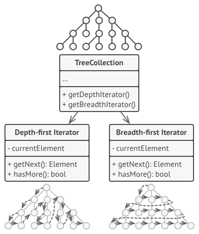

## Iterator Pattern

### What

**Iterator** is a behavioral design pattern that lets you traverse elements of a collection without exposing its underlying representation

### Why

#### problem

- Collections are one of the most used data types in programming. 

- A collection is just a container for a group of objects.
- No matter how a collection is structured, it must provide some way of accessing its elements so that other code can use these elements. 
- Adding traversal algorithms to the collection gradually blurs its primary responsibility, which is efficient data storage. Additionally, some algorithms might be tailored for a specific application, so including them into a generic collection class would be weird.
- On the other hand, the client code that’s supposed to work with various collections may not even care how they store their elements. However, since collections all provide different ways of accessing their elements, you have no option other than to couple your code to the specific collection classes.

#### Real-World Analogy

All of these options—the random directions born in your head, the smartphone navigator or the human guide—act as iterators over the vast collection of sights and attractions located in Rome.

### How

The main idea of the Iterator pattern is to extract the traversal behavior of a collection into a separate object called an *iterator*.

- In addition to implementing the algorithm itself, an iterator object encapsulates all of the traversal details. (several iterators can go through the same collection at the same time)
- All iterators must implement the same interface. This makes the client code compatible with any collection type or any traversal algorithm as long as there’s a proper iterator. If you need a special way to traverse a collection, you just create a new iterator class, without having to change the collection or the client.
