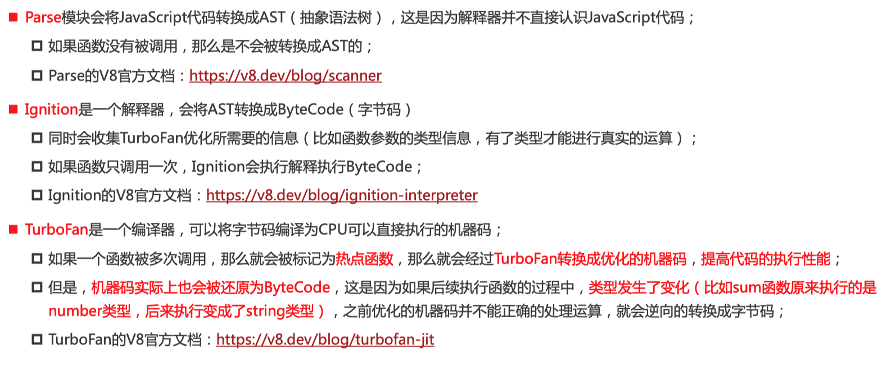

为什么需要JavaScript引擎呢？
- 我们前面说过，高级的编程语言都是需要转成最终的机器指令来执行的； 
- 事实上我们编写的JavaScript无论你交给浏览器或者Node执行，最后都是需要被CPU执行的； 
- 但是CPU只认识自己的指令集，实际上是机器语言，才能被CPU所执行； 
- 所以我们需要JavaScript引|擎帮助我们将JavaScript代码翻译成CPU指令来执行；

1. SpiderMonkey：第一款JavaScript引|/擎，由Brendan Eich开发（也就是JavaScript作者）； 
2. Chakra：微软开发，用于IT浏览器； 
3. JavaScriptcore：Webkit中的JavaScript引/擎，Apple公司开发； 
4. V8:Google开发的强大JavaScript引擎，也帮助Chrome从众多浏览器中脱颖而出：

以WebKit为例，WebKit事实上由两部分组成的： 
- WebCore：负责HTML解析、布局、渲染等等相关的工作； 
- JavaScriptcore：解析、执行JavaScript代码；

### V8

1. js =>  ast
2. ast => （ignation）字节码 bytecode

（环境不一样 cpu架构不一样 机器指令不一样 所以要先转成bytecode ）

3. turbofan => MachineCode 优化的机器码
4. Deoptimization

